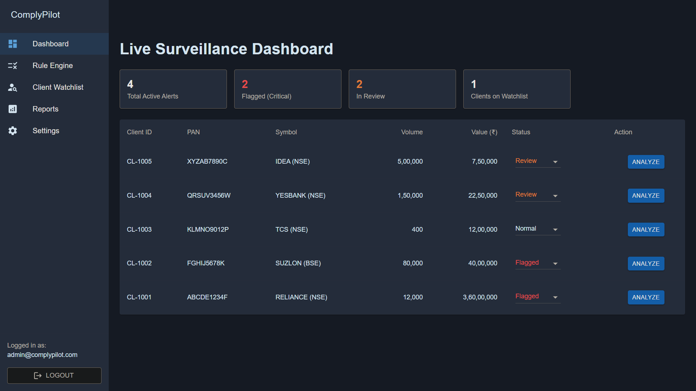
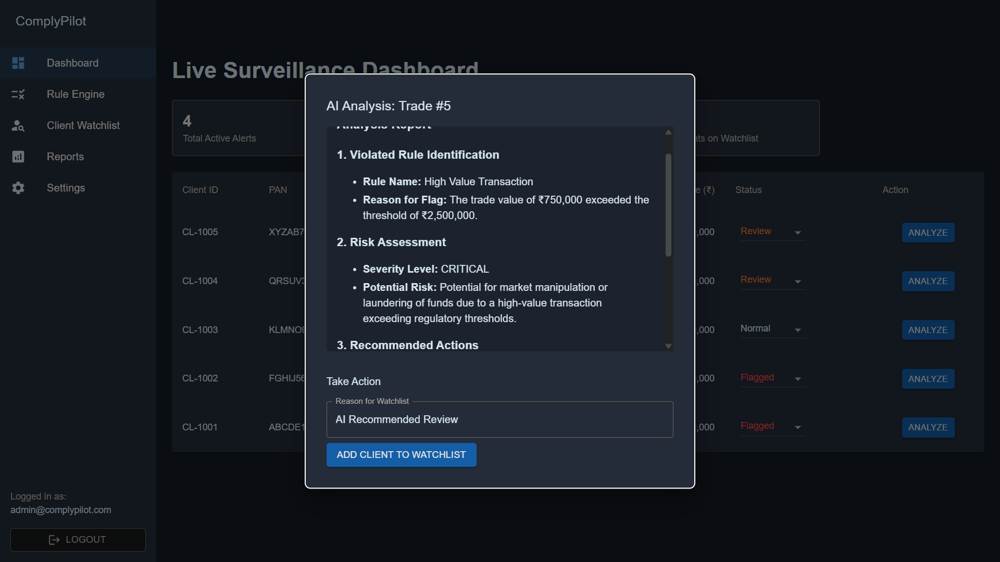
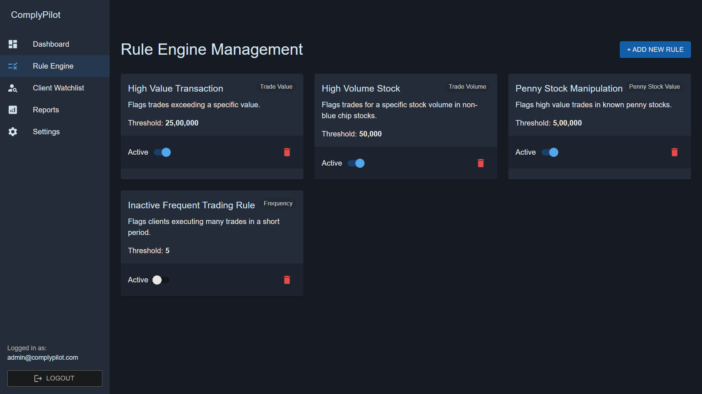

# 🚀 ComplyPilot V1.0 – AI-Powered Compliance Co-Pilot  
*Compliance-as-a-Service (CaaS) for Indian SME Stockbrokers*


## 🎯 1. Context & Vision  
- **Problem:** SME stockbrokers lack real-time surveillance and rely on manual processes—risking regulatory non-compliance.  
- **Solution:** ComplyPilot provides live monitoring, AI-guided compliance analysis, and centralized tools.

---

## 🛠️ 2. Key Features  

### 📊 Live Surveillance Dashboard  
- Summary stat cards (e.g. total alerts, critical flags)  
- Interactive alerts table with dynamic status transitions: `Open` → `In Review` → `Closed`

### 🤖 AI Co-Pilot  
- Single-click analysis using active compliance rules  
- Generates professional Markdown advice with clear next steps  
- Allows instant “Add to Watchlist” during review

### ⚙️ Rule Engine  
- Card-based interface to **view**, **activate**, or **deactivate** compliance rules  
- AI Co-Pilot always references the current, active rule-set

### 🔍 Client Watchlist  
- Add clients directly during the AI review  
- Central page listing all clients under special monitoring

### 🔔 Notifications  
- Informative toast popups for user actions:  
  `Rule saved`, `Client watchlisted`, `Alert status changed`, etc.

---

## 💻 3. Tech Stack Overview  

| **Component**       | **Technology**                                     |
|---------------------|-----------------------------------------------------|
| Backend API         | Python 3.10+, FastAPI, SQLAlchemy, Alembic         |
| Database            | SQLite                                              |
| Frontend            | React.js, Material-UI (MUI)                         |
| AI Layer            | LLaMA 3 (via LM Studio, local model inference)      |
| Authentication      | JWT tokens and Passlib for secure password hashing  |

### 📸 Screenshots

Here is the main dashboard of ComplyPilot.



The AI Co-Pilot provides instant analysis and clear next steps.



The dynamic Rule Engine allows compliance officers to customize the AI's logic by activating or deactivating rules instantly.



---


## 🚀 4. Quick Start Guide  

### ✅ Prerequisites  
- Python 3.10+  
- Node.js v18+  
- Git  
- LM Studio with LLaMA-3 model (downloaded and ready)

### 🧱 Step 1: Clone & Navigate  
```bash
git clone https://github.com/Anshulmehra001/ComplyPilot.git
cd complypilot
🐍 Step 2: Backend Setup (Terminal 1)
bash
Copy code
cd backend
python -m venv venv
# On Windows:
.\venv\Scripts\activate
# On macOS/Linux:
source venv/bin/activate
pip install -r requirements.txt
alembic upgrade head
uvicorn main:app --reload
🌐 Step 3: Frontend Setup (Terminal 2)
bash
Copy code
cd ../frontend
npm install
npm start
➕ Additional Frontend Dependencies (Terminal 2)
bash
Copy code
npm install @mui/material @emotion/react @emotion/styled @mui/icons-material react-router-dom axios react-markdown
This installs Material-UI core, emotion styling dependencies (required by the default MUI theme engine), icons, router, HTTP client, and rendering Markdown support 
MUI
npm
.

🧠 Step 4: Start AI & Initialize Mock Data (Terminal 3)
Open LM Studio, select your LLaMA-3 model, and click Start Server

In a new terminal, run:

powershell
Copy code
Invoke-RestMethod -Method Post -Uri http://localhost:8000/api/setup/init
Close when setup completes successfully

🔐 Step 5: Log In
Visit: http://localhost:3000

Email: admin@complypilot.com

Password: password

🛠️ 5. Troubleshooting Tips
uvicorn not recognized:
Ensure the virtual environment is activated and rerun pip install -r requirements.txt

sqlite3.OperationalError: no such table: users:
Delete complypilot.db, rerun alembic upgrade head, and restart the backend

Frontend: “module not found” errors:
Stop npm start, rerun npm install, then restart

/api/setup/init returns “Not Found”:
Verify backend is running and you’re in the correct directory

